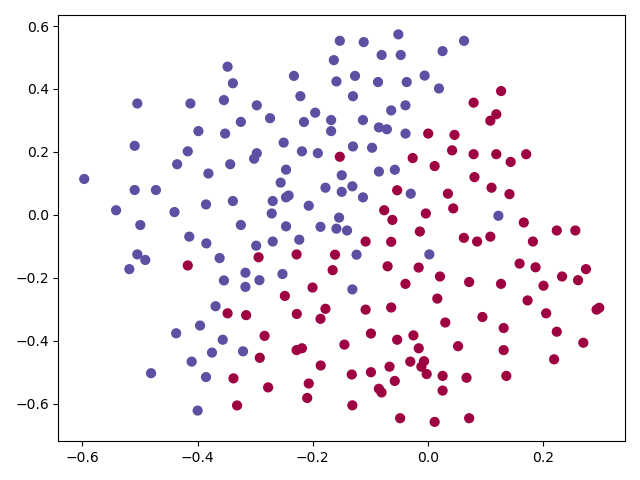
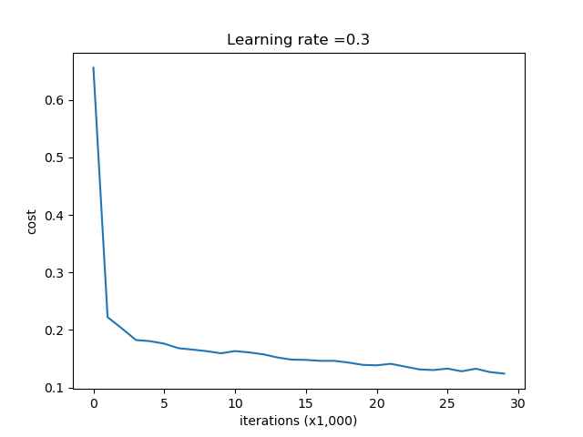
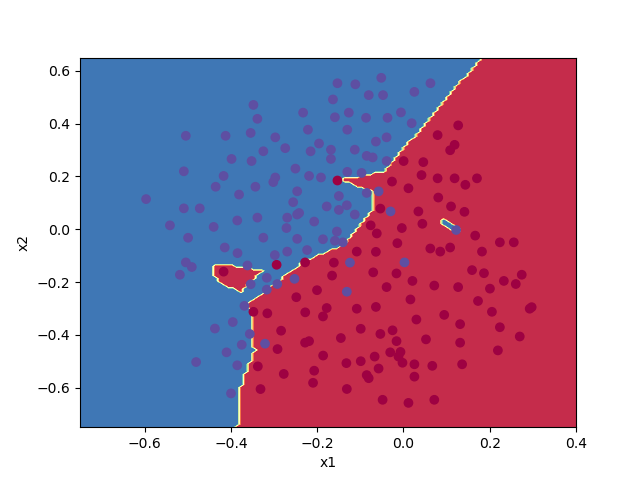
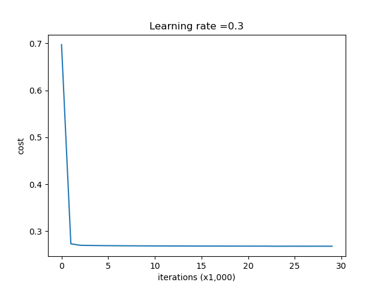
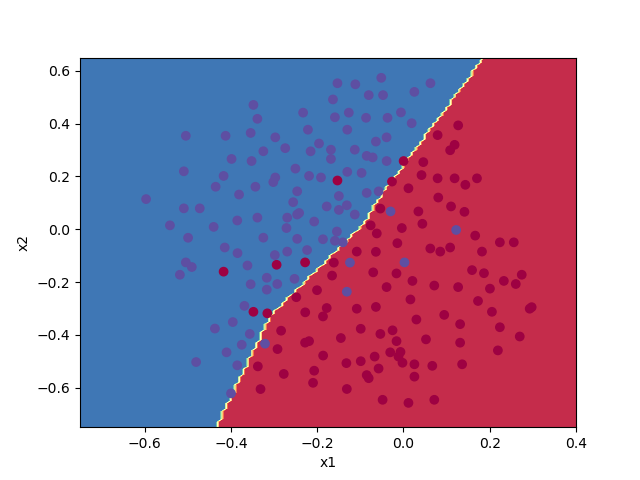
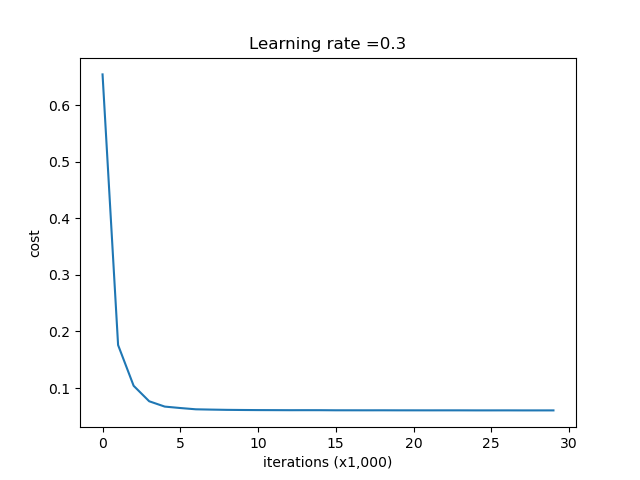
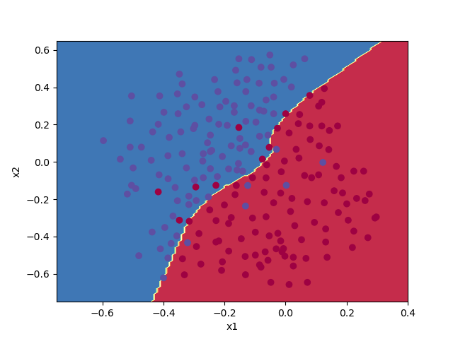

# ANN Regularization
# Week 1 Assignment 2 
# Improving Deep Neural Networks: Hyperparameter tuning, Regularization and Optimization   

#### Visualize Data
python vizualize.py  

###### The ANN will try to classify blue vs red

 
### No Regularization 

python Runner.py 0 1   

The first arg is the value of 'lambda' the regularization param  
The second is the dropout keep probability.
Both should be between 0 and 1, though no validation has been implemented.  
0 and 1 meeans, lambda is 0 => no regularization,  
the keep probability is 1 => no dropout since all the nodes are kept during training. 

Train/Test accuracy: 0.9479 / 0.915  

##### Learning Curve  
  

##### Decision Boundary
  

### Regularization lambda=0.7  
python Runner.py 0.7 1  

Train/Test accuracy: 0.938 / 0.93  

  

##### Decision Boundary
  

### Dropout
python Runner.py 0 0.86  

Train/Test accuracy: 0.929 / 0.95  

  

##### Decision Boundary
  
